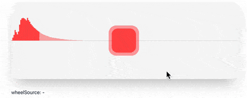

<h1 align="center">WheelGestures</h1>
<p align="center">
  <a href="https://wheel-gestures.xiel.dev">
    
  </a>
</p>
<p align="center">
  wheel gestures and momentum detection in the browser
</p>

<p align="center">
  <a href="https://www.npmjs.com/package/wheel-gestures" rel="nofollow"></a>
</p>

<hr/>

## Installation

Install wheel-gestures using your package manager:

```sh
yarn add wheel-gestures # OR npm install wheel-gestures
```

## Usage 

Import and create an instance of WheelGestures and then add the element you want to observe.

````TypeScript
import { WheelGestures } from 'wheel-gestures'

// create an instance per element
const wheelGestures = WheelGestures()

// find and observe the element the user can interact with
const element = window.document.querySelector('.slider')
wheelGestures.observe(element)

// add your event callback 
wheelGestures.on('wheel', (wheelEventState) => {
  //...
})
````

There are [options](https://wheel-gestures.xiel.dev/docs/options/) to customize the behaviour.

#### WheelEventState

This is the TypeScript type of the WheelEventState object provided. Even if you do not use TypeScript, this might be helpful to see how the data is provided:

````TypeScript
export type VectorXYZ = [number, number, number]

export interface WheelEventState {
  isStart: boolean
  isMomentum: boolean
  isEnding: boolean
  isMomentumCancel: boolean
  axisDelta: VectorXYZ
  axisVelocity: VectorXYZ
  axisMovement: VectorXYZ
  axisMovementProjection: VectorXYZ
  event: WheelEvent | WheelEventData
  previous?: WheelEventState
}
````

Read more in the [docs](https://wheel-gestures.xiel.dev).

**OS & Browsers**

- Mac OS (Chrome, Firefox, Safari, Edge), Magic Mouse, Magic Trackpad
- Windows (Chrome, Firefox, Edge), Microsoft Precision Touchpads

#### Prior Art

Other people also thought that it might be helpful for some interactions to be able to distinguish between user initiated wheel events and the ones that are triggered by inertia scroll, but none of the other known libraries delivered results in the precision I needed, so I developed my own solution. Honourable mentions:

- https://github.com/promo/wheel-indicator
- https://github.com/d4nyll/lethargy
